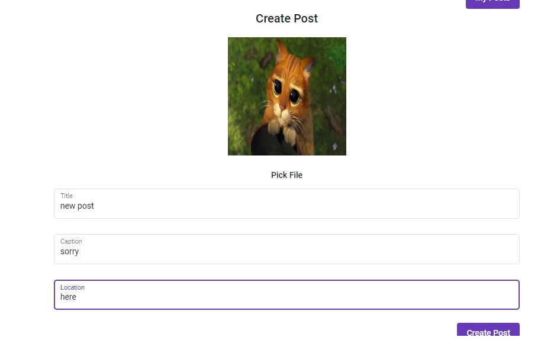

# **Photoposter**

##This is simple social network which provide opportunity to share photo, comment and  like it.

###This project contains spring boot app [link to folder](main) and angular application [link to folder](src) .

## Required
Java 11, Angular 11, PostgreSQL, node js.

### Install
1. Download
2. Create table in Postgre with name "photoposter", paste your credentials to application.properties [link to folder](main/resources), run DB, run SpringBootApp.
3. Go to angular app folder [link to folder](src) , run console(terminal) , then run npm install, after ng serve.
4. Test: 
- Angular http://localhost:4200
- Spring use postman http://localhost:8080

### Examples
#### Register page

#### Login page

#### Post page

#### Main page

